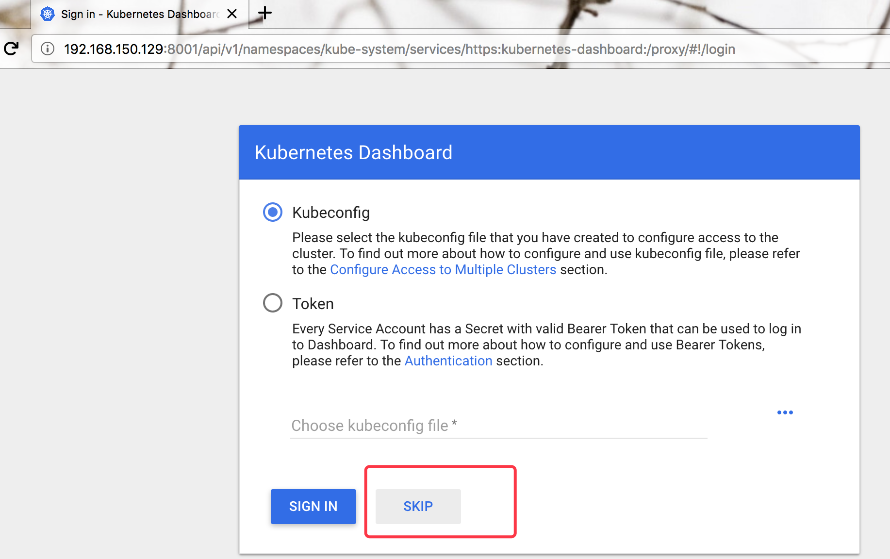
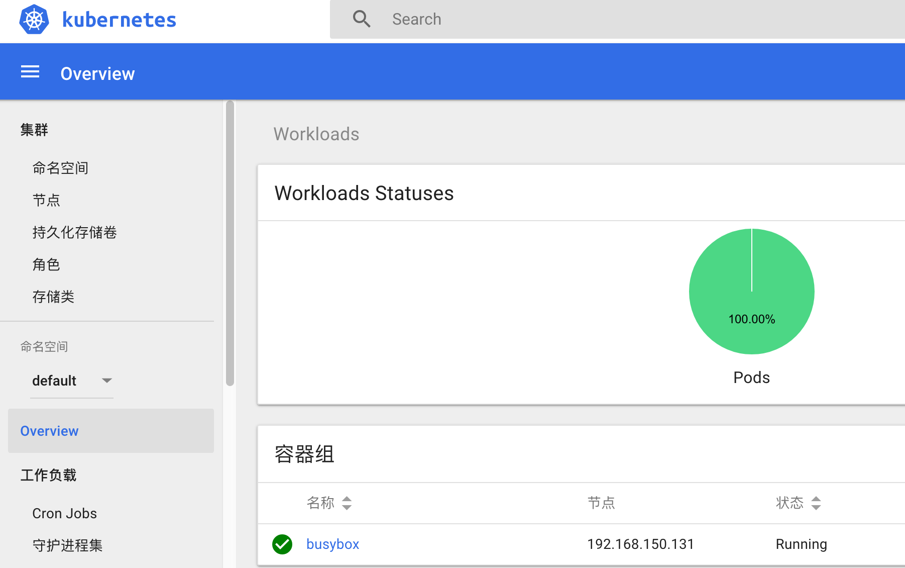

# 从头开始构建 Kubernetes 集群

## 系统信息

| 节点 | 地址 | 用途 |
| :-- | :-- | :-- |
| master | 192.168.150.129 | Kubernetes master & etcd node |
| node1  | 192.168.150.130 | Kubernetes node & etcd node |
| node2  | 192.168.150.131 | Kubernetes node & etcd node |


```
# cat /etc/centos-release
CentOS Linux release 7.4.1708 (Core)
# uname -r
3.10.0-693.el7.x86_64
# systemctl stop firewalld
# systemctl disable firewalld   // 关闭 firealld
# getenforce                    // 关闭 SELinux
Disabled
```

## 添加 YUM 源

默认的 YUM 源版本相对比较低，我们可以通过添加以下 repo，用来安装较新版本的 `Kubernetes`：

```
[virt7-container-common-candidate]
name=virt7-container-common-candidate
baseurl=https://cbs.centos.org/repos/virt7-container-common-candidate/x86_64/os/
enabled=1
gpgcheck=0
```

> [Installing Docker - CentOS-7](https://wiki.centos.org/Container/Tools)

## 证书创建

本章节 etcd 和 kubernetes 都使用 tls 安装认证，针对非 tls 的这里不再赘述（非 tls 会简单很多）。

CoreOS 官网详细介绍了通过 `cfssl` 工具生成证书，具体可以参考 [Generate self-signed certificates](https://coreos.com/os/docs/latest/generate-self-signed-certificates.html)。

### 下载 `cfssl` 工具

```
mkdir ~/bin
curl -s -L -o ~/bin/cfssl https://pkg.cfssl.org/R1.2/cfssl_linux-amd64
curl -s -L -o ~/bin/cfssljson https://pkg.cfssl.org/R1.2/cfssljson_linux-amd64
chmod +x ~/bin/{cfssl,cfssljson}
export PATH=$PATH:~/bin
```

### 初始化证书认证

```
mkdir ~/cfssl
cd ~/cfssl
cfssl print-defaults config > ca-config.json
cfssl print-defaults csr > ca-csr.json
```

* `client` 证书被用于客户端通过服务端进行身份认证。如 etcdctl、etcd proxy、fleetctl 或者 docker clients
* `server` 证书是由服务端使用并由客户端验证以获得授权。如 docker server 或者 kube-apiserver
* `peer` 证书用于 etcd cluster members 之间通信

#### 配置 CA 选项

CA 配置文件为 `ca-config.json`，修改如下：

```
{
    "signing": {
        "default": {
            "expiry": "87600h"
        },
        "profiles": {
            "server": {
                "expiry": "87600h",
                "usages": [
                    "signing",
                    "key encipherment",
                    "server auth"
                ]
            },
            "client": {
                "expiry": "87600h",
                "usages": [
                    "signing",
                    "key encipherment",
                    "client auth"
                ]
            },
            "peer": {
                "expiry": "87600h",
                "usages": [
                    "signing",
                    "key encipherment",
                    "server auth",
                    "client auth"
                ]
            }
        }
    }
}
```

你也可以修改 `ca-csr.json` 证书签名请求（CSR）：

```
{
    "CN": "CA",
    "key": {
        "algo": "rsa",
        "size": 2048
    },
    "names": [
        {
            "C": "CN",
            "L": "Zhejiang",
            "ST": "Hangzhou"
        }
    ]
}
```

通过自定义选项生成 CA：

```
cfssl gencert -initca ca-csr.json | cfssljson -bare ca -
```

得到如下证书文件：

```
ca-key.pem
ca.csr
ca.pem
```

* `ca-key.pem` 文件要好好保存。通过该文件可以在你的 CA 中创建任何类型的证书。
* `*.csr` 文件本例中暂时不会用到

#### 生成服务端证书

```
cfssl print-defaults csr > server.json
```

修改`server.json`，内容如下：

```
{
    "CN": "server",
    "hosts": [
        "127.0.0.1",
        "192.168.150.129",
        "192.168.150.130",
        "192.168.150.131"
    ],
    "key": {
        "algo": "rsa",
        "size": 2048
    },
    "names": [
        {
            "C": "CN",
            "L": "Zhejiang",
            "ST": "Hangzhou"
        }
    ]
}
```

其中 __hosts__ 和 __Common Name (CN)__ 字段比较重要，__hosts__ 字段填写集群节点 IP。

通过命令生成 `server` 证书：

```
cfssl gencert -ca=ca.pem -ca-key=ca-key.pem -config=ca-config.json -profile=server server.json | cfssljson -bare server
```

得到如下证书文件：

```
server-key.pem
server.csr
server.pem
```

#### 生成 `peer` 证书

```
cfssl print-defaults csr > member1.json
```

修改内容如下：

```
{
    "CN": "member1",
    "hosts": [
        "192.168.150.129",
        "127.0.0.1"
    ],
    "key": {
        "algo": "rsa",
        "size": 2048
    },
    "names": [
        {
            "C": "CN",
            "L": "Zhejiang",
            "ST": "Hangzhou"
        }
    ]
}
```

通过命令生成 `peer` 证书：

```
cfssl gencert -ca=ca.pem -ca-key=ca-key.pem -config=ca-config.json -profile=peer member1.json | cfssljson -bare member1
```

得到如下证书文件：

```
member1-key.pem
member1.csr
member1.pem
```

`peer` 证书比较特殊，修改 `CN` 字段名，如 member2、member3，并修改 `hosts` 字段，重复以上操作生成证书。（`hosts` 字段填写对应的集群节点 IP 即可）

#### 生成客户端证书

```
cfssl print-defaults csr > client.json
```

修改 `client.json`：

```
{
    "CN": "client",
    "hosts": [
        ""
    ],
    "key": {
        "algo": "rsa",
        "size": 2048
    },
    "names": [
        {
            "C": "CN",
            "L": "Zhejiang",
            "ST": "Hangzhou"
        }
    ]
}
```

生成 `client` 证书：

```
cfssl gencert -ca=ca.pem -ca-key=ca-key.pem -config=ca-config.json -profile=client client.json | cfssljson -bare client
```

#### 修改证书权限

```
chmod 600 -R ~/cfssl/*.pem
```

## etcd 集群

etcd 官方提供非常好的安装部署 workflow，可以参见 [Install and deploy etcd](http://play.etcd.io/install)

### 安装

```
yum install -y etcd         // 三个节点通过 yum 安装 etcd
```

### 同步证书到节点

* 192.168.150.129 `/etc/etcd/ssl/`

```
ca.pem
member1-key.pem
member1.pem
server-key.pem
server.pem
```

* 192.168.150.130 `/etc/etcd/ssl/`

```
ca.pem
member2-key.pem
member2.pem
server-key.pem
server.pem
```

* 192.168.150.131 `/etc/etcd/ssl/`

```
ca.pem
member3-key.pem
member3.pem
server-key.pem
server.pem
```

统一修改证书权限为 etcd 用户：

```
chown etcd:etcd -R /etc/etcd/ssl
```

### etcd 配置

修改各节点 `/etc/etcd/etcd.conf` 配置如下：

* 192.168.150.129

```
# grep -vE '^#|^$' /etc/etcd/etcd.conf
ETCD_NAME=192.168.150.129
ETCD_DATA_DIR="/var/lib/etcd/192.168.150.129.etcd"
ETCD_LISTEN_PEER_URLS="https://192.168.150.129:2380"
ETCD_LISTEN_CLIENT_URLS="https://192.168.150.129:2379,https://127.0.0.1:2379"
ETCD_INITIAL_ADVERTISE_PEER_URLS="https://192.168.150.129:2380"
ETCD_INITIAL_CLUSTER="192.168.150.129=https://192.168.150.129:2380,192.168.150.130=https://192.168.150.130:2380,168.150.131=https://192.168.150.131:2380"
ETCD_INITIAL_CLUSTER_STATE="new"
ETCD_INITIAL_CLUSTER_TOKEN="etcd-cluster"
ETCD_ADVERTISE_CLIENT_URLS="https://192.168.150.129:2379"
ETCD_CERT_FILE="/etc/etcd/ssl/server.pem"
ETCD_KEY_FILE="/etc/etcd/ssl/server-key.pem"
ETCD_CLIENT_CERT_AUTH="true"
ETCD_TRUSTED_CA_FILE="/etc/etcd/ssl/ca.pem"
ETCD_PEER_CERT_FILE="/etc/etcd/ssl/member1.pem"
ETCD_PEER_KEY_FILE="/etc/etcd/ssl/member1-key.pem"
ETCD_PEER_CLIENT_CERT_AUTH="true"
ETCD_PEER_TRUSTED_CA_FILE="/etc/etcd/ssl/ca.pem"
```

* 192.168.150.130

```
# grep -vE '^#|^$' /etc/etcd/etcd.conf
ETCD_NAME=192.168.150.130
ETCD_DATA_DIR="/var/lib/etcd/192.168.150.130.etcd"
ETCD_LISTEN_PEER_URLS="https://192.168.150.130:2380"
ETCD_LISTEN_CLIENT_URLS="https://192.168.150.130:2379,https://127.0.0.1:2379"
ETCD_INITIAL_ADVERTISE_PEER_URLS="https://192.168.150.130:2380"
ETCD_INITIAL_CLUSTER="192.168.150.129=https://192.168.150.129:2380,192.168.150.130=https://192.168.150.130:2380,168.150.131=https://192.168.150.131:2380"
ETCD_INITIAL_CLUSTER_STATE="new"
ETCD_INITIAL_CLUSTER_TOKEN="etcd-cluster"
ETCD_ADVERTISE_CLIENT_URLS="https://192.168.150.130:2379"
ETCD_CERT_FILE="/etc/etcd/ssl/server.pem"
ETCD_KEY_FILE="/etc/etcd/ssl/server-key.pem"
ETCD_CLIENT_CERT_AUTH="true"
ETCD_TRUSTED_CA_FILE="/etc/etcd/ssl/ca.pem"
ETCD_PEER_CERT_FILE="/etc/etcd/ssl/member2.pem"
ETCD_PEER_KEY_FILE="/etc/etcd/ssl/member2-key.pem"
ETCD_PEER_CLIENT_CERT_AUTH="true"
ETCD_PEER_TRUSTED_CA_FILE="/etc/etcd/ssl/ca.pem"
```

* 192.168.150.131

```
ETCD_NAME=192.168.150.131
ETCD_DATA_DIR="/var/lib/etcd/192.168.150.131.etcd"
ETCD_LISTEN_PEER_URLS="https://192.168.150.131:2380"
ETCD_LISTEN_CLIENT_URLS="https://192.168.150.131:2379,https://127.0.0.1:2379"
ETCD_INITIAL_ADVERTISE_PEER_URLS="https://192.168.150.131:2380"
ETCD_INITIAL_CLUSTER="192.168.150.129=https://192.168.150.129:2380,192.168.150.130=https://192.168.150.130:2380,192.168.150.131=https://192.168.150.131:2380"
ETCD_INITIAL_CLUSTER_STATE="new"
ETCD_INITIAL_CLUSTER_TOKEN="etcd-cluster"
ETCD_ADVERTISE_CLIENT_URLS="https://192.168.150.131:2379"
ETCD_CERT_FILE="/etc/etcd/ssl/server.pem"
ETCD_KEY_FILE="/etc/etcd/ssl/server-key.pem"
ETCD_CLIENT_CERT_AUTH="true"
ETCD_TRUSTED_CA_FILE="/etc/etcd/ssl/ca.pem"
ETCD_PEER_CERT_FILE="/etc/etcd/ssl/member3.pem"
ETCD_PEER_KEY_FILE="/etc/etcd/ssl/member3-key.pem"
ETCD_PEER_CLIENT_CERT_AUTH="true"
ETCD_PEER_TRUSTED_CA_FILE="/etc/etcd/ssl/ca.pem"
```

### 启动 etcd

```
systemctl enable etcd
systemctl start etcd
```

客户端通过 `client` 证书验证集群状态

```
# ETCDCTL_ENDPOINT=https://192.168.150.129:2379,https://192.168.150.130:2379,https://192.168.150.131:2379 etcdctl --cert-file=/root/cfssl/client.pem --key-file=/root/cfssl/client-key.pem  --ca-file=/etc/etcd/ssl/ca.pem  cluster-health
member 304bc49cfdaa154f is healthy: got healthy result from https://192.168.150.130:2379
member b11bce7cadfd39e8 is healthy: got healthy result from https://192.168.150.129:2379
member e4f0cdb23f2f804e is healthy: got healthy result from https://192.168.150.131:2379
cluster is healthy
# ETCDCTL_ENDPOINT=https://192.168.150.129:2379,https://192.168.150.130:2379,https://192.168.150.131:2379 etcdctl --cert-file=/root/cfssl/client.pem --key-file=/root/cfssl/client-key.pem  --ca-file=/etc/etcd/ssl/ca.pem  member list
304bc49cfdaa154f: name=192.168.150.130 peerURLs=https://192.168.150.130:2380 clientURLs=https://192.168.150.130:2379 isLeader=false
b11bce7cadfd39e8: name=192.168.150.129 peerURLs=https://192.168.150.129:2380 clientURLs=https://192.168.150.129:2379 isLeader=true
e4f0cdb23f2f804e: name=192.168.150.131 peerURLs=https://192.168.150.131:2380 clientURLs=https://192.168.150.131:2379 isLeader=false
```

## Docker

通过 yum 安装 Docker：

```
yum install -y docker
```

修改默认 docker systemd 配置文件 `/usr/lib/systemd/system/docker.service` 如下：

```
[Unit]
Description=Docker Application Container Engine
Documentation=http://docs.docker.com
After=network.target docker-containerd.service
Wants=docker-storage-setup.service
Requires=docker-containerd.service

[Service]
Type=notify
EnvironmentFile=-/etc/sysconfig/docker
EnvironmentFile=-/etc/sysconfig/docker-storage
EnvironmentFile=-/etc/sysconfig/docker-network
Environment=GOTRACEBACK=crash
ExecStart=/usr/bin/dockerd-current \
          --add-runtime oci=/usr/libexec/docker/docker-runc-current \
          --default-runtime=oci \
          --containerd /run/containerd.sock \
          --exec-opt native.cgroupdriver=systemd \
          --userland-proxy-path=/usr/libexec/docker/docker-proxy-current \
          --init-path=/usr/libexec/docker/docker-init-current \
          --seccomp-profile=/etc/docker/seccomp.json \
          $OPTIONS \
          $DOCKER_STORAGE_OPTIONS \
          $DOCKER_NETWORK_OPTIONS \
          $ADD_REGISTRY \
          $BLOCK_REGISTRY \
          $INSECURE_REGISTRY \
          $REGISTRIES
ExecReload=/bin/kill -s HUP $MAINPID
LimitNOFILE=1048576
LimitNPROC=1048576
LimitCORE=infinity
TimeoutStartSec=0
Restart=on-abnormal

[Install]
WantedBy=multi-user.target
```

取消 `/etc/sysconfig/docker` 默认 __OPTIONS__ 配置（统一配置在 `/etc/docker/daemon.json`）：

```
# /etc/sysconfig/docker

# Modify these options if you want to change the way the docker daemon runs
OPTIONS=''
if [ -z "${DOCKER_CERT_PATH}" ]; then
    DOCKER_CERT_PATH=/etc/docker
fi

# Do not add registries in this file anymore. Use /etc/containers/registries.conf
# from the atomic-registries package.
#

# On an SELinux system, if you remove the --selinux-enabled option, you
# also need to turn on the docker_transition_unconfined boolean.
# setsebool -P docker_transition_unconfined 1

# Location used for temporary files, such as those created by
# docker load and build operations. Default is /var/lib/docker/tmp
# Can be overriden by setting the following environment variable.
# DOCKER_TMPDIR=/var/tmp

# Controls the /etc/cron.daily/docker-logrotate cron job status.
# To disable, uncomment the line below.
# LOGROTATE=false
#

# docker-latest daemon can be used by starting the docker-latest unitfile.
# To use docker-latest client, uncomment below line
#DOCKERBINARY=/usr/bin/docker-latest
```

修改配置 `/etc/docker/daemon.json` 如下：

```
{
    "storage-driver": "overlay2",
    "log-opts": {
        "max-size": "200m",
        "max-file": "5"
    },
    "log-level": "warn",
    "registry-mirrors": [
        "https://registry.docker-cn.com",
        "http://hub-mirror.c.163.com"
    ]
}
```

> **[info] 标注**  
> 如果有私有镜像，那么需要添加 `insecure-registries` 字段到配置中去，如 `"insecure-registries": [ "<私有 registry repo 地址>" ]`

## Flannel

通过 yum 安装 Flannel：

```
yum install -y flannel
```

同步证书：

```
mkdir /etc/flannel/ssl -p
```

```
# ls -l /etc/flannel/ssl/
total 12
-rw------- 1 root root 1257 Dec 11 16:25 ca.pem
-rw------- 1 root root 1679 Dec 11 16:25 client-key.pem
-rw-r--r-- 1 root root 1306 Dec 11 16:25 client.pem
```


修改配置 `/etc/sysconfig/flanneld` 如下：

```
# Flanneld configuration options

# etcd url location.  Point this to the server where etcd runs
FLANNEL_ETCD_ENDPOINTS="https://192.168.150.129:2379,https://192.168.150.130:2379,https://192.168.150.131:2379"

# etcd config key.  This is the configuration key that flannel queries
# For address range assignment
FLANNEL_ETCD_PREFIX="/atomic.io/network"

# Any additional options that you want to pass
FLANNEL_OPTIONS="-etcd-cafile=/etc/flannel/ssl/ca.pem -etcd-certfile=/etc/flannel/ssl/client.pem -etcd-keyfile=/etc/flannel/ssl/client-key.pem"
```

在 etcd 中写入 Flannel 配置：

```
ETCDCTL_ENDPOINT=https://192.168.150.129:2379,https://192.168.150.130:2379,https://192.168.150.131:2379 etcdctl --cert-file=/etc/flannel/ssl/client.pem --key-file=/etc/flannel/ssl/client-key.pem  --ca-file=/etc/flannel/ssl/ca.pem mk /atomic.io/network/config '{"Network":"172.17.0.0/16", "SubnetLen": 25,"Backend": {"Type": "host-gw"}}'
```

> **[info] 标注**  
> etcd 中写入配置，只需要选择一个节点执行一次即可。

Flannel 有多种类型选择，常见有 udp、vxlan 以及本例中使用的 host-gw，更多的可以参见 Flannel 官方文档 [Flannel Backends](https://github.com/coreos/flannel/blob/master/Documentation/backends.md)。

### 启动 Flannel & Docker

```
systemctl daemon-reload
systemctl start flanneld
systemctl enable flanneld
systemctl start docker
systemctl enable docker
```

可以看到两个节点都已经分配到了 Flannel 的网络：

```
[root@node1 ~]# ifconfig docker0
docker0: flags=4099<UP,BROADCAST,MULTICAST>  mtu 1500
        inet 172.17.37.1  netmask 255.255.255.128  broadcast 0.0.0.0
        ether 02:42:ae:e2:41:a2  txqueuelen 0  (Ethernet)
        RX packets 0  bytes 0 (0.0 B)
        RX errors 0  dropped 0  overruns 0  frame 0
        TX packets 0  bytes 0 (0.0 B)
        TX errors 0  dropped 0 overruns 0  carrier 0  collisions 0
```

```
[root@node2 ~]# ifconfig docker0
docker0: flags=4099<UP,BROADCAST,MULTICAST>  mtu 1500
        inet 172.17.33.1  netmask 255.255.255.128  broadcast 0.0.0.0
        ether 02:42:8d:92:66:8e  txqueuelen 0  (Ethernet)
        RX packets 0  bytes 0 (0.0 B)
        RX errors 0  dropped 0  overruns 0  frame 0
        TX packets 0  bytes 0 (0.0 B)
        TX errors 0  dropped 0 overruns 0  carrier 0  collisions 0
```

测试跨节点连通：

```
# route -n
Kernel IP routing table
Destination     Gateway         Genmask         Flags Metric Ref    Use Iface
0.0.0.0         192.168.150.2   0.0.0.0         UG    0      0        0 ens33
169.254.0.0     0.0.0.0         255.255.0.0     U     1002   0        0 ens33
172.17.15.128   192.168.150.129 255.255.255.128 UG    0      0        0 ens33
172.17.33.0     0.0.0.0         255.255.255.128 U     0      0        0 docker0
172.17.37.0     192.168.150.130 255.255.255.128 UG    0      0        0 ens33
192.168.150.0   0.0.0.0         255.255.255.0   U     0      0        0 ens33
[root@node2 ~]# ping -c 1 172.17.37.1
PING 172.17.37.1 (172.17.37.1) 56(84) bytes of data.
64 bytes from 172.17.37.1: icmp_seq=1 ttl=64 time=1.84 ms

--- 172.17.37.1 ping statistics ---
1 packets transmitted, 1 received, 0% packet loss, time 0ms
rtt min/avg/max/mdev = 1.846/1.846/1.846/0.000 ms
```

> **[info] 标注**  
> 当前 yum 安装的 flannel 版本为 flannel-0.7.1-2.el7.x86_64，结合 yum 安装版本的 K8s 1.8.1 出现了问题，节点之间可以互相 ping 通，但是针对 pod 只能和当前节点的 pod 通信，跨节点不可以，最后升级 flannel 到官方 0.9.1 版本解决。

## Kubernetes Master

### 安装配置

通过 yum 安装 `Kubernetes`：

```
yum install -y kubernetes --disablerepo=extras
```

生成 apiserver 的证书，因为 apiserver 的特殊性这里单独生成证书：

```
cfssl print-defaults csr > api-server.json
```

修改 `api-server.json` 内容：

```
{
    "CN": "server",
    "hosts": [
        "192.168.150.129",
        "10.254.0.1"
    ],
    "key": {
        "algo": "rsa",
        "size": 2048
    },
    "names": [
        {
            "C": "CN",
            "L": "Zhejiang",
            "ST": "Hangzhou"
        }
    ]
}
```

> **[info] 标注**  
> 此处加入的 10.254.0.1，是 `Kubernetes` 集群创建后默认创建的内部 apiserver 通信地址，根据实际情况修改，这里采用的是默认值。


```
cfssl gencert -ca=ca.pem -ca-key=ca-key.pem -config=ca-config.json -profile=server api-server.json | cfssljson -bare api-server
```

```
# chown kube:kube -R /srv/kubernetes
# ls -l /srv/kubernetes/*
-rw------- 1 kube kube 1679 Dec 11 17:43 api-server-key.pem
-rw------- 1 kube kube 1318 Dec 11 17:43 api-server.pem
-rw------- 1 kube kube 1257 Dec 11 15:36 ca.pem
-rw------- 1 kube kube 1679 Dec 11 16:25 client-key.pem
-rw------- 1 kube kube 1306 Dec 11 16:25 client.pem
```

修改配置 `/etc/kubernetes/config`：

```
###
# kubernetes system config
#
# The following values are used to configure various aspects of all
# kubernetes services, including
#
#   kube-apiserver.service
#   kube-controller-manager.service
#   kube-scheduler.service
#   kubelet.service
#   kube-proxy.service
# logging to stderr means we get it in the systemd journal
KUBE_LOGTOSTDERR="--logtostderr=true"

# journal message level, 0 is debug
KUBE_LOG_LEVEL="--v=0"

# Should this cluster be allowed to run privileged docker containers
KUBE_ALLOW_PRIV="--allow-privileged=true"

# How the controller-manager, scheduler, and proxy find the apiserver
KUBE_MASTER="--master=http://127.0.0.1:8080"
```

修改 apiserver 配置 `/etc/kubernetes/apiserver` 如下：

```
###
# kubernetes system config
#
# The following values are used to configure the kube-apiserver
#

# The address on the local server to listen to.
KUBE_API_ADDRESS="--insecure-bind-address=127.0.0.1"

# The port on the local server to listen on.
# KUBE_API_PORT="--port=8080"

# Port minions listen on
# KUBELET_PORT="--kubelet-port=10250"

# Comma separated list of nodes in the etcd cluster
KUBE_ETCD_SERVERS="--etcd-servers=https://192.168.150.129:2379,https://192.168.150.130:2379,https://192.168.150.131:2379"

# Address range to use for services
# service 的 ip 池根据实际情况修改，保证不和内部业务冲突即可
KUBE_SERVICE_ADDRESSES="--service-cluster-ip-range=10.254.0.0/16"

# default admission control policies
KUBE_ADMISSION_CONTROL="--admission-control=NamespaceLifecycle,LimitRanger,SecurityContextDeny,ServiceAccount,ResourceQuota"

# Add your own!
KUBE_API_ARGS="--max-requests-inflight=2000 --client-ca-file=/srv/kubernetes/ca.pem --tls-cert-file=/srv/kubernetes/api-server.pem --tls-private-key-file=/srv/kubernetes/api-server-key.pem --etcd-cafile=/srv/kubernetes/ca.pem --etcd-certfile=/srv/kubernetes/client.pem --etcd-keyfile=/srv/kubernetes/client-key.pem"
```

修改 controller-manager 配置 `/etc/kubernetes/controller-manager` 如下：

```
###
# The following values are used to configure the kubernetes controller-manager

# defaults from config and apiserver should be adequate

# Add your own!
KUBE_CONTROLLER_MANAGER_ARGS="--root-ca-file=/srv/kubernetes/ca.pem --service-account-private-key-file=/srv/kubernetes/api-server-key.pem --pod-eviction-timeout=120s"
```

修改 scheduler 配置 `/etc/kubernetes/scheduler` 如下：

```
###
# kubernetes scheduler config

# default config should be adequate

# Add your own!
KUBE_SCHEDULER_ARGS=""
```

### 启动 Master

```
systemctl start kube-apiserver
systemctl start kube-controller-manager
systemctl start kube-scheduler
systemctl enable kube-apiserver
systemctl enable kube-controller-manager
systemctl enable kube-scheduler
```

```
# kubectl cluster-info
Kubernetes master is running at http://localhost:8080

To further debug and diagnose cluster problems, use 'kubectl cluster-info dump'.
```

## Kubernetes Nodes

### 安装

通过 yum 安装 `Kubernetes`：

```
yum install -y kubernetes --disablerepo=extras
```

同步证书：

```
# ls -l /srv/kubernetes/*
-rw------- 1 root root 1257 Dec 10 14:40 /srv/kubernetes/ca.pem
-rw------- 1 root root 1679 Dec 10 14:41 /srv/kubernetes/client-key.pem
-rw------- 1 root root 1334 Dec 10 14:41 /srv/kubernetes/client.pem
```

### kubelet & kube-proxy 配置

创建 kubeconfig 文件 `/var/lib/kubelet/.kubeconfig`：

```
apiVersion: v1
kind: Config
clusters:
- cluster:
    certificate-authority: /srv/kubernetes/ca.pem
    server: https://192.168.150.129:6443
  name: k8s
users:
- name: kubelet
  user:
    client-certificate: /srv/kubernetes/client.pem
    client-key: /srv/kubernetes/client-key.pem
contexts:
- context:
    cluster: k8s
    user: kubelet
```


修改配置文件 `/etc/kubernetes/config`：

```
###
# kubernetes system config
#
# The following values are used to configure various aspects of all
# kubernetes services, including
#
#   kube-apiserver.service
#   kube-controller-manager.service
#   kube-scheduler.service
#   kubelet.service
#   kube-proxy.service
# logging to stderr means we get it in the systemd journal
KUBE_LOGTOSTDERR="--logtostderr=true"

# journal message level, 0 is debug
KUBE_LOG_LEVEL="--v=0"

# Should this cluster be allowed to run privileged docker containers
KUBE_ALLOW_PRIV="--allow-privileged=true"

# How the controller-manager, scheduler, and proxy find the apiserver
KUBE_MASTER="--master=https://192.168.150.129:6443"
```

修改 kubelet 配置文件 `/etc/kubernetes/kubelet`：

```
###
# kubernetes kubelet (minion) config

# The address for the info server to serve on (set to 0.0.0.0 or "" for all interfaces)
KUBELET_ADDRESS="--address=0.0.0.0"

# The port for the info server to serve on
# KUBELET_PORT="--port=10250"

# location of the kubeconfig
KUBELET_API_SERVER="--kubeconfig=/var/lib/kubelet/.kubeconfig"

# You may leave this blank to use the actual hostname
# 此处以 IP 代理主机名，根据实际地址修改
KUBELET_HOSTNAME="--hostname-override=192.168.150.130"

# Add your own!
KUBELET_ARGS="--cgroup-driver=systemd --fail-swap-on=false --image-gc-high-threshold=95 --image-gc-low-threshold=80 --serialize-image-pulls=false --max-pods=30 --container-runtime=docker --cloud-provider=''"
```

> **[warning] 标注**  
> 因为 `GFW` 的原因，默认的 pause 镜像 `gcr.io/google_containers/pause-amd64` 可能会被墙，因此建议下载该镜像上传到私有仓库中，通过选项 `--pod-infra-container-image=<私有 registry repo 地址>/google_containers/pause-amd64:3.0` 加入到配置 `KUBELET_ARGS` 替换默认值。

修改 kube-proxy 配置 `/etc/kubernetes/proxy`：

```
###
# kubernetes proxy config

# default config should be adequate

# Add your own!
KUBE_PROXY_ARGS="--kubeconfig=/var/lib/kubelet/.kubeconfig"
```

### 启动 kubelet & kube-proxy

```
systemctl start kubelet
systemctl enable kubelet
systemctl start kube-proxy
systemctl enable kube-proxy
```

Master 上查询当前节点，显示两个节点均已注册：

```
[root@master ~]# kubectl get nodes
NAME              STATUS    ROLES     AGE       VERSION
192.168.150.130   Ready     <none>    1h        v1.8.1
192.168.150.131   Ready     <none>    1h        v1.8.1
```

通过一个简单的 pod 创建实例验证集群是否正常：

```
[root@master ~]# cat test-pod.yaml
apiVersion: v1
kind: Pod
metadata:
  name: busybox
spec:
  containers:
    - name: busybox
      image: busybox:latest
      args: [sh, -c, 'sleep 9999999999']
[root@master ~]# kubectl create -f test-pod.yaml
root@master ~]# kubectl get pods -o wide
NAME      READY     STATUS    RESTARTS   AGE       IP            NODE
busybox   1/1       Running   1          4m        172.17.33.2   192.168.150.131
```

## KubeDNS

修改官方 kubedns yaml 文件 [kube-dns.yaml.base](https://github.com/kubernetes/kubernetes/blob/master/cluster/addons/dns/kube-dns.yaml.base)，替换 `__PILLAR__DNS__SERVER__` 和 `__PILLAR__DNS__DOMAIN__` 为实际配置，本例中分别替换为 `10.254.0.10` 和 `cluster.local`。

> **[info] 标注**  
> 同之前的镜像一样，kubedns 默认的镜像源都是 `gcr.io`，因为被墙的原因，建议通过某些不可描述的手段下载之后上传到自己的内部私有镜像仓库中。

```
root@master ~]# kubectl create -f kube-dns.yaml
[root@master ~]# kubectl get pods --namespace=kube-system
NAME                        READY     STATUS    RESTARTS   AGE
kube-dns-574498665f-z5fkf   3/3       Running   0          12m
[root@master ~]# kubectl get svc --namespace=kube-system
NAME       TYPE        CLUSTER-IP    EXTERNAL-IP   PORT(S)         AGE
kube-dns   ClusterIP   10.254.0.10   <none>        53/UDP,53/TCP   12m
```

### 更新 kubelet 配置

追加 `--cluster-dns=10.254.0.10` 和  `--cluster-domain=cluster.local` 选项到 `/etc/kubernetes/kubelet` 中的 `KUBELET_ARGS` 配置上，并重启 kubelet：

```
###
# kubernetes kubelet (minion) config

# The address for the info server to serve on (set to 0.0.0.0 or "" for all interfaces)
KUBELET_ADDRESS="--address=0.0.0.0"

# The port for the info server to serve on
# KUBELET_PORT="--port=10250"

# location of the kubeconfig
KUBELET_API_SERVER="--kubeconfig=/var/lib/kubelet/.kubeconfig"

# You may leave this blank to use the actual hostname
KUBELET_HOSTNAME="--hostname-override=192.168.150.131"

# Add your own!
KUBELET_ARGS="--cgroup-driver=systemd --fail-swap-on=false --image-gc-high-threshold=95 --image-gc-low-threshold=80 --serialize-image-pulls=false --max-pods=30 --container-runtime=docker --cloud-provider='' --pod-infra-container-image=dockerhub.test.wacai.info/google_containers/pause-amd64:3.0 --cluster-dns=10.254.0.10 --cluster-domain=cluster.local"
```

```
systemctl restart kubelet
```

### 验证 DNS

选择任何一个节点验证即可，显示解析成功：

```
[root@node2 ~]# dig kubernetes.default.svc.cluster.local @10.254.0.10

; <<>> DiG 9.9.4-RedHat-9.9.4-51.el7_4.1 <<>> kubernetes.default.svc.cluster.local @10.254.0.10
;; global options: +cmd
;; Got answer:
;; ->>HEADER<<- opcode: QUERY, status: NOERROR, id: 42754
;; flags: qr aa rd ra; QUERY: 1, ANSWER: 1, AUTHORITY: 0, ADDITIONAL: 0

;; QUESTION SECTION:
;kubernetes.default.svc.cluster.local.        IN A

;; ANSWER SECTION:
kubernetes.default.svc.cluster.local. 30 IN A 10.254.0.1

;; Query time: 1 msec
;; SERVER: 10.254.0.10#53(10.254.0.10)
;; WHEN: Mon Dec 11 19:09:42 CST 2017
;; MSG SIZE  rcvd: 72
```

## Kube Dashboard

```
kubectl apply -f https://raw.githubusercontent.com/kubernetes/dashboard/master/src/deploy/recommended/kubernetes-dashboard.yaml
```

> **[info] 标注**  
> 同前面的问题，当中使用的镜像可能被墙，可以提前下载好 push 到内部私有镜像仓库即可。

开启代理访问：

```
[root@master ~]# kubectl proxy --address='192.168.150.129' --accept-hosts='^*$'
Starting to serve on 192.168.150.129:8001
```

> **[info] 标注**  
> 注意添加 `--accept-hosts='^*$'` 选项，否则会显示页面 `<h3>Unauthorized</h3>` 。

浏览器访问如下地址：

```
http://192.168.150.129:8001/api/v1/namespaces/kube-system/services/https:kubernetes-dashboard:/proxy/
```

因为没有开启相关认证，可以直接跳过登录页面：



进入 Dashboard 页面之后便可以进行相关的界面操作了：


