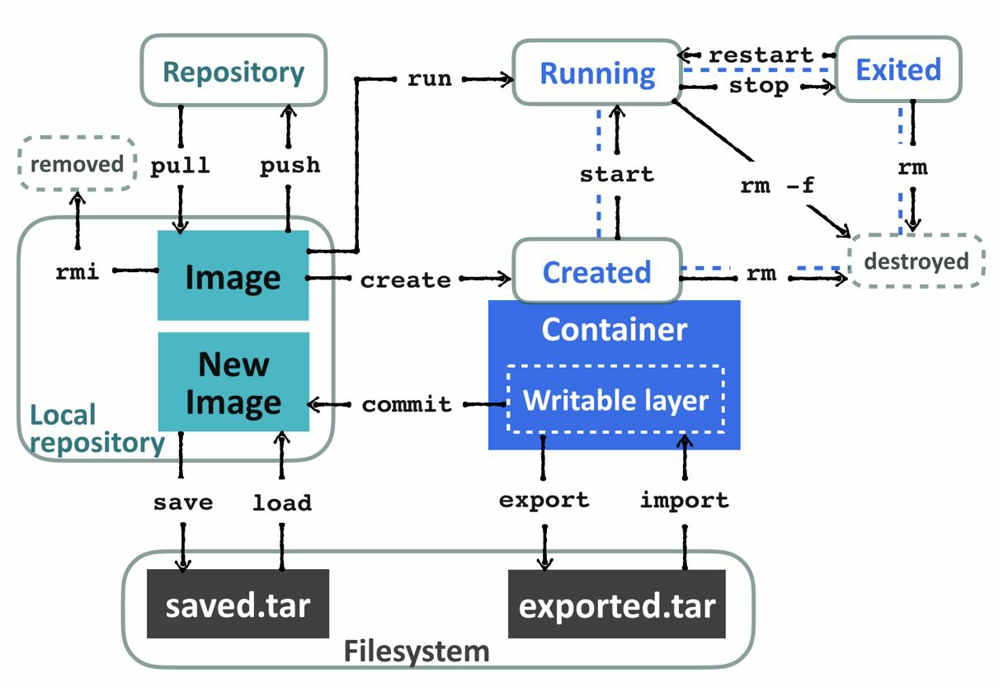

# Docker 概述

可能现在称 Docker 为 `Moby` 比较合适，2017 年 4 月 Github [docker](https://github.com/docker/docker) 项目已经正式改名为 [moby](https://github.com/moby/moby)。至于个中缘由，可以通过 [对于 Docker 改名 Moby ，大家怎么看？](https://www.zhihu.com/question/58805021) 做进一步了解，此处不过多说明，本文继续沿用 Docker。

说起 Docker 不得不提到传统的 VM 虚拟化。传统虚拟机实现资源隔离的方法是利用独立的 OS，并利用 `Hypervisor` 虚拟化 CPU、内存、IO 设备等。Docker 基于容器技术的轻量级虚拟化，相对于传统的虚拟化技术，省去了 `Hypervisor` 层的开销，而且其虚拟化技术是基于内核的 `Cgroup` 和 `Namespace` 技术，处理逻辑与内核深度融合。

容器本身不是一个新技术，早期的 Linux 容器是基于 LXC 去管理的，而 Docker 让容器变得更易用。对于 Docker，可以认为它是一个开源的容器引擎，可以方便的对容器进行管理，并且通过镜像交付的方式，达到更简单的环境构建，理念就是 “Build, Ship, and Run Any App, Anywhere”。

## Docker 名词介绍

### Docker 镜像

Docker 镜像是 Docker 容器运行时的只读模板，每一个镜像由一系列的层 (layers) 组成。按照官方说明，镜像是一个轻量级，独立的，可执行的，包括软件运行一切所需，囊括了代码，运行态，lib 库以及环境变量和配置文件的包。通俗的理解，可以理解为一个封装好环境的集装箱。

### Docker 容器

容器是通过 Docker 镜像创建的一个运行态的实例，可以针对 Docker 容器执行运行、开始、停止、移动和删除等操作。

### Docker Registry

`Registry` 用来存放 Docker 镜像，如果把 Docker 镜像比作集装箱的话，那么 `Registry` 可比喻成装载集装箱的大货轮。`Registry` 有公有和私有的概念，Docker 官方 `Registry` 为 [Docker Hub](https://hub.docker.com)，国内的如阿里云、网易蜂巢、时速云等也均有相关仓库。Docker 镜像仓库起到了一个集中存储和分发 Docker 镜像的作用。

三者之间的关系可以参考下图（摘自《DevOps Kubernetes》）：

### 拓展

-   [Visualizing Docker Containers and Images
    ](http://merrigrove.blogspot.com/2015/10/visualizing-docker-containers-and-images.html)

## Docker 原理

关于 Docker 的原理需要结合 Linux 底层的 `Cgroup` 和 `Namespace` 去理解。Docker 通过 `Cgroup` 实现针对每个容器的资源管理，如 CPU、Memory、IO 等，而通过 `Namespace` 让每个容器都拥有自己的命名空间，包括 PID、USER、UTS、MNT、NET、IPC 等。

如果需要深入理解相关知识，可以通过以下文章进一步学习：

-   [Docker 核心技术与实现原理](https://draveness.me/docker)
-   [Docker基础技术：Linux CGroup](https://coolshell.cn/articles/17049.html)
-   [Docker基础技术：Linux Namespace（上）](https://coolshell.cn/articles/17010.html)
-   [Docker基础技术：Linux Namespace（下）](https://coolshell.cn/articles/17029.html)
