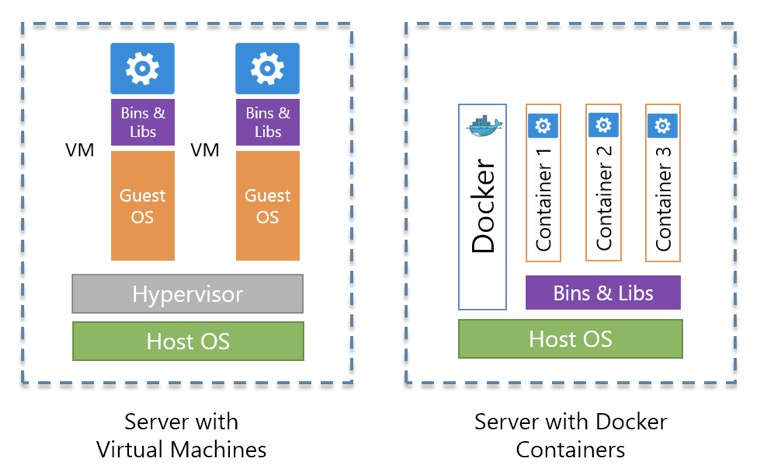
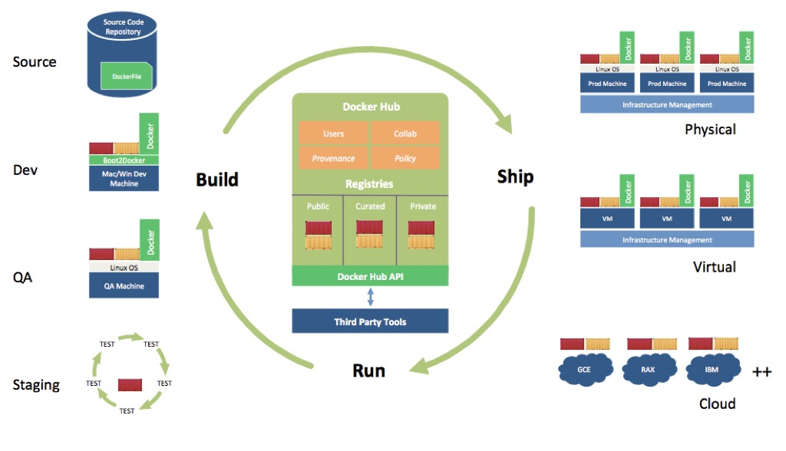

# Docker 理论

## Docker 简介

可能现在称 `Docker` 为 `Moby` 比较合适，2017 年 4 月 Github [docker](https://github.com/docker/docker) 项目已经正式改名为 [moby](https://github.com/moby/moby)。至于个中缘由，可以通过 [对于 Docker 改名 Moby ，大家怎么看？](https://www.zhihu.com/question/58805021) 做进一步了解，此处不过多说明，本文继续沿用 `Docker`。

说起 `Docker` 不得不提到传统的 VM 虚拟化。传统虚拟机实现资源隔离的方法是利用独立的 OS，并利用 `Hypervisor` 虚拟化 CPU、内存、IO 设备等。`Docker` 基于容器技术的轻量级虚拟化，相对于传统的虚拟化技术，省去了 `Hypervisor` 层的开销，而且其虚拟化技术是基于内核的 `cgroup` 和 `Namespace` 技术，处理逻辑与内核深度融合。

对于 `Docker`，可以认为它是一个开源的容器引擎，可以方便的对容器进行管理，并且通过镜像交付的方式，达到更简单的环境构建，理念就是 “Build, Ship, and Run Any App, Anywhere”。

## Docker 名词介绍

### Docker 镜像

`Docker` 镜像是 `Docker` 容器运行时的只读模板，每一个镜像由一系列的层 (layers) 组成。按照官方说明，镜像是一个轻量级，独立的，可执行的，包括软件运行一切所需，囊括了代码，运行态，lib 库以及环境变量和配置文件的包。通俗的理解，可以理解为一个集装箱。

### Docker 容器

容器是通过 `Docker` 镜像创建的一个运行态的实例，可以针对 `Docker` 容器执行运行、开始、停止、移动和删除等操作。

### Docker Registry

`Docker Registry` 用来存放 `Docker` 镜像，如果把 `Docker` 镜像比作集装箱的话，那么 `Docker Registry` 可比喻成装载集装箱的大货轮。`Docker Registry` 有公有和私有的概念，`Docker` 官方 `Registry` 为 [Docker Hub](https://hub.docker.com)，国内的如阿里云、网易蜂巢、时速云等也均有相关仓库。Docker 镜像仓库起到了一个集中存储和分发 `Docker` 镜像的作用。

