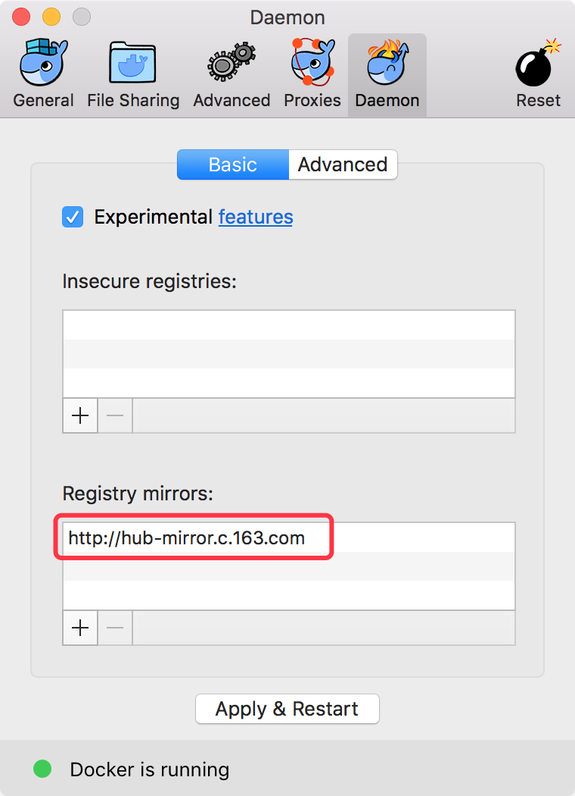

# Docker 安装与配置

## 安装

上文说的 `Moby` 在 Docker 官网称为社区版，支持的系统可以参见 [Install Docker](https://docs.docker.com/engine/installation/)。从 Docker `17.03` 开始，Docker 使用基于时间的版本发行机制。支持的系统除了常见的 Linux 发行版外，还支持 macOS、Windows 系统。本文只介绍基于 macOS 和 CentOS 这两个系统的 Docker 安装，关于更多系统的安装方式参见前面提到的官网安装文档。

### macOS Docker 安装

关于 macOS Docker 的安装方式官方教程已经很详细了，[Install Docker for Mac](https://docs.docker.com/docker-for-mac/install/)。目前针对 Mac 系统，官方的 Docker 支持 `OS X El Capitan 10.11` 或者更新的 `macOS` 发行版，针对硬件也有限制，只支持 2010 或者更新的 Mac。

下载 [Get Docker for Mac [stable]](https://download.docker.com/mac/stable/Docker.dmg) dmg 文件，双击即可安装，安装之后点击运行 Docker。因为国内下载镜像比较慢的原因，所以需要额外配置一下国内的 Registry mirror 用以加速镜像下载：

<center></center>

目前国内有很多家企业提供公共的镜像加速服务：

* 网易云镜像加速 [http://hub-mirror.c.163.com/](http://hub-mirror.c.163.com/)
* Docker 中国官方镜像加速 [https://registry.docker-cn.com](https://registry.docker-cn.com)

除以上两个公开的加速器外，还有阿里云、Daocloud 等厂商也提供加速服务，不过需要通过注册帐号登录才可以获取专有的镜像加速服务地址。

> __注：__ macOS 上运行 Docker，需要注意的是删除镜像占用空间也不会释放，所以如果你的 Mac 磁盘不是很大的话，还是得悠着点用，具体的详情可以参见这个帖子 [Docker.qcow2 never shrinks - disk space usage leak in docker for mac](https://github.com/docker/for-mac/issues/371)

### CentOS7 Docker 安装

关于 Docker 社区版在 CentOS 上的安装，官网提供了教程 [Get Docker CE for CentOS](https://docs.docker.com/engine/installation/linux/docker-ce/centos/)，最新版本的 Docker CE 本文暂时不做介绍，以 CentOS 源提供版本为主。

```
# cat /etc/centos-release
CentOS Linux release 7.3.1611 (Core)
```

Docker 已收录在 `CentOS-Extras` 软件库内，可以直接通过如下方式安装

```
yum install -y docker
```

当前通过 CentOS 源默认安装版本为 `1.12.6`。`1.12.6` 默认配置如下：

```
# grep -vE '^$|^#' /etc/sysconfig/docker
OPTIONS='--selinux-enabled --log-driver=journald --signature-verification=false'
if [ -z "${DOCKER_CERT_PATH}" ]; then
    DOCKER_CERT_PATH=/etc/docker
fi
```

默认源除了提供 `1.12.6` 以外，还提供一个 `docker-latest` 的版本，该版本为 `1.13.1`，可以通过以下方式安装：

```
yum install -y docker-latest
```

关于 `docker-latest` 更详细信息可以参考红帽官方介绍 [Introducing docker-latest for RHEL 7 and RHEL Atomic Hos](https://access.redhat.com/articles/2317361)，笔者不建议直接使用该软件版本。

如果要安装一个较新的版本，还可以通过加入以下软件库实现：

```
[virt7-docker-common-candidate]
name=virt7-docker-common-candidate
baseurl=https://cbs.centos.org/repos/virt7-docker-common-candidate/x86_64/os/
enabled=1
gpgcheck=0
```

```
yum install -y docker --disablerepo=extras
```

> __注：__ 经过实际测试，当前 virt7-docker-common-candidate 库 `docker-1.13.1-17.git27e468e.el7.x86_64` 版本因为包依赖问题安装不了，后续会继续关注，毕竟使用的源是候选版本。
```
Error: Package: 2:docker-1.13.1-17.git27e468e.el7.x86_64 (virt7-docker-common-candidate)
           Requires: atomic-registries
Error: Package: 2:docker-1.13.1-17.git27e468e.el7.x86_64 (virt7-docker-common-candidate)
           Requires: container-storage-setup
 You could try using --skip-broken to work around the problem
 You could try running: rpm -Va --nofiles --nodigest
```

> 关于 Docker `1.13` 和 `1.12` 版本的区别可以参见 [Docker 1.13.0 详细更新日志](http://dockone.io/article/1834)

### Reference

* [Installing Docker - CentOS-7](https://wiki.centos.org/Cloud/Docker)

## Docker 配置

* `/etc/sysconfig/docker`
* `/etc/sysconfig/docker-storage`
* `/etc/sysconfig/docker-network`
* `/etc/docker/daemon.js`

Docker 从 `1.12` 开始支持通过 `/etc/docker/daemon.js` 文件管理 Docker daemon 的配置选项。
