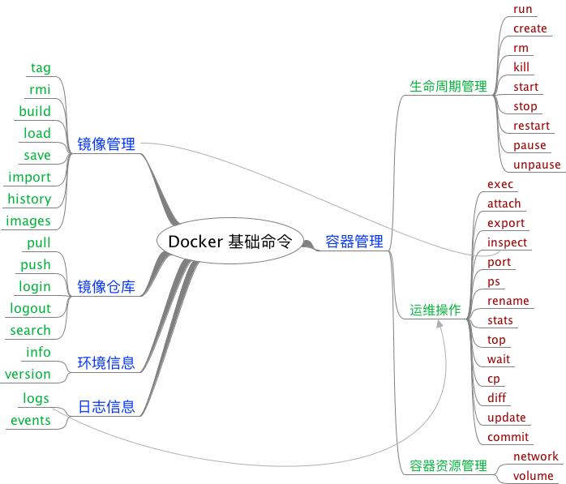

# Docker 基础命令



## Docker run 命令

> 详细内容见官方文档 [Docker run reference](https://docs.docker.com/engine/reference/run/)

```
# docker run --help

Usage:  docker run [OPTIONS] IMAGE [COMMAND] [ARG...]

Run a command in a new container
```

### Detached vs foreground

容器的运行方式有前台和后台（detached）两种模式，默认为前台运行。

#### Detached (-d)

| 选项 | 说明 |
| :--  | :--  |
| -d, --detach | 后台运行容器，并输出容器 id |

使用 `-d` 选项或者 `-d=true` 使得容器后台运行：

```
# docker run -d busybox sleep 20
a69a80e9e16298255612c6ba73efc94b3d43d40d7ae30e4832c5e4b41de24356
# docker attach a69a80
```

使用 `docker attach` 命令重新连接后台容器。`attach` 可以理解为在当前终端，连接到后台运行的容器，等同前台操作运行容器。

#### Foreground

| 选项 | 说明 |
| :--  | :--  |
| -a, --attach list | Attach to STDIN, STDOUT or STDERR (default []) |
| -t, --tty | 分配一个伪终端 |
| --sig-proxy | 转发所有的信号给进程 (默认为 true，仅在 non-tty 模式下生效) |
| -i, --interactive | 保持 STDIN 打开即使在后台运行 |

```
# docker run --rm -it busybox sh
/ # echo "This is a test"
This is a test
```

* `--rm`: 选项表示容器停止后，自动清理容器，方便调试情况下使用，不能和 `-d` 选项同时执行
* `-it`: `-i`、`-t` 选项一般同时执行，用于和容器交互操作，比较常用

#### 相关快捷键

* 退出：`Ctrl-D` or `exit`
* detach：`Ctrl-P` + `Ctrl-Q`
* attach: `docker attach <container_id>`

### 运行时资源限制

Docker 目前支持 MEM、CPU、IO 等资源的限制。

如果要进行压测，可以使用工具 [stress](http://people.seas.harvard.edu/~apw/stress/) 进行内存、CPU 的压测，通过如下 Dockerfile 构建简单的压测镜像：

```
# cat Dockerfile
FROM ubuntu:latest

RUN apt-get update && \
    apt-get install stress && \
    rm -rf /var/lib/apt/lists/*
# docker build -t ubuntu-stress:latest .
```

stress 工具常用命令：

```
stress --vm 1 --vm-bytes 1000M  # 占用 1000MB 内存
stress -c 1                     # 占用 1core CPU
stress --cpu 8 --io 4 --vm 2 --vm-bytes 128M --timeout 10s
```

#### 内存限制

| 选项 | 说明 |
| :-- | :-- |
| --kernel-memory string | 内核内存限制 |
| -m, --memory string | 内存限制，最小 4M |
| --memory-reservation string | 内存软限制 |
| --memory-swap string | 内存总限制（memory + swap）， `-1` 表示不限制 swap |
| --memory-swappiness int | 调整容器 swappiness (0 to 100) (默认 `-1`) |
| --oom-kill-disable | 禁用 OOM Killer |
| --oom-score-adj int | 调整 OOM 优先级 (-1000 to 1000) |


* `-m, --memory string`，`--memory-swap string`

关闭 swap 限制（宿主 swap 多少，则容器就能使用多少），并且设置内存限制为 300M：

```
# docker run -it -m 300M --memory-swap -1 ubuntu
```

```
# docker run -it -m 300M ubuntu
```

如果只设置 `--memory` 限制，默认情况下，总虚拟内存大小 (`--memory-swap`) 会设置成内存的两倍，即内存和 swap 之和 2*300M。意味着这个容器可以使用 300M 的内存以及 300M 的 swap。

```
# docker run -it -m 300M --memory-swap 1G ubuntu
```

因 `--memory-swap` 是内存和 swap 之和，此例中容器内存限制为 300M，容器 swap 限制大小为 700M。

`docker stats <container_id>` 命令可以查看容器运行的资源占用状态，其中内存只显示 `--memory` 设定，swap 占用不会显示。

```
# docker stats 90eb76ad26d2
CONTAINER           CPU %               MEM USAGE / LIMIT   MEM %               NET I/O             BLOCK I/O           PIDS
90eb76ad26d2        0.00%               900KiB / 300MiB     0.29%               1.95kB / 0B         0B / 0B             1
```

* `--memory-reservation string`

`--memory-reservation` 内存预留选项用于设置内存的软限制，在正常情况下，容器可以根据需要使用尽可能多的内存，并且仅受限于使用 `--memory` 选项设置的硬限制。Docker 会检测内存抢占或内存不足，在这种情况下，Docker 会强制容器将其消耗限制在预留限制内。`--memory-reservation` 设定值要低于 `--memory`，否则 `--memory` 优先。

* `--memory-swappiness int`

swappiness 可以认为是宿主 `/proc/sys/vm/swappiness` 设定：

> Swappiness is a Linux kernel parameter that controls the relative weight given to swapping out runtime memory, as opposed to dropping pages from the system page cache. Swappiness can be set to values between 0 and 100 inclusive. A low value causes the kernel to avoid swapping, a higher value causes the kernel to try to use swap space. [Swappiness](https://en.wikipedia.org/wiki/Swappiness)

`--memory-swappiness=0` 表示禁用容器 swap 功能。这点不同于宿主机，宿主机 swappiness 即使设置为 0 也不保证 swap 不会被使用。默认情况下，该值继承父进程设置。

```
# docker run -it --memory-swappiness=0 ubuntu
```

* `--oom-kill-disable`，`--oom-score-adj int`

OOM 相关命令选项一般不建议使用，特别针对以下这种没有对容器作任何资源限制的情况，添加 `--oom-kill-disable` 选项就比较 __危险__ 了：

```
# docker run -it --oom-kill-disable ubuntu:14.04
```

因为此时容器内存没有限制，并且不会被 oom kill，此时系统为了释放内存，就可能会 kill 系统进程用于释放内存。

#### CPU 限制

| 选项 | 说明 |
| :-- | :-- |
| --cpu-period int     | Limit CPU CFS (Completely Fair Scheduler) period   |
| --cpu-quota int      | Limit CPU CFS (Completely Fair Scheduler) quota    |
| --cpu-rt-period int  | Limit CPU real-time period in microseconds         |
| --cpu-rt-runtime int | Limit CPU real-time runtime in microseconds        |
| -c, --cpu-shares int |     CPU shares (relative weight)                   |
| --cpus decimal       | Number of CPUs (default 0.000)                     |
| --cpuset-cpus string | CPUs in which to allow execution (0-3, 0,1)        |
| --cpuset-mems string | MEMs in which to allow execution (0-3, 0,1)        |

* CPU share constraint: `-c` or `--cpu-shares`

默认所有的容器对于 CPU 的利用占比都是一样的，`-c` 或者 `--cpu-shares` 可以设置 CPU 利用率权重，默认为 1024，可以设置权重为 2 或者更高(单个 CPU 为 1024，两个为 2048，以此类推)。如果设置选项为 0，则系统会忽略该选项并且使用默认值 1024。通过以上设置，只会在 CPU 密集(繁忙)型运行进程时体现出来。当一个 container 空闲时，其它容器都是可以占用 CPU 的。cpu-shares 值为一个相对值，实际 CPU 利用率则取决于系统上运行容器的数量。

假如一个 1core 的主机运行 3 个 container，其中一个 cpu-shares 设置为 1024，而其它 cpu-shares 被设置成 512。当 3 个容器中的进程尝试使用 100% CPU 的时候「尝试使用 100% CPU 很重要，此时才可以体现设置值」，则设置 1024 的容器会占用 50% 的 CPU 时间。如果又添加一个 cpu-shares 为 1024 的 container，那么两个设置为 1024 的容器 CPU 利用占比为 33%，而另外两个则为 16.5%。简单的算法就是，所有设置的值相加，每个容器的占比就是 CPU 的利用率，如果只有一个容器，那么此时它无论设置 512 或者 1024，CPU 利用率都将是 100%。当然，如果主机是 3core，运行 3 个容器，两个 cpu-shares 设置为 512，一个设置为 1024，则此时每个 container 都能占用其中一个 CPU 为 100%。

```
# docker run -it --rm --cpu-shares 512 ubuntu
```

* CPU period & quota constraint: `--cpu-period` & `--cpu-quota`

默认的 CPU CFS「Completely Fair Scheduler」period 是 100ms。我们可以通过 `--cpu-period` 值限制容器的 CPU 使用。一般 `--cpu-period` 配合 `--cpu-quota` 一起使用。

设置 cpu-period 为 50ms，cpu-quota 为 25ms。如果有一个 CPU，那么表示该 CPU 每 50ms 运行时段，容器可以占用该 CPU 50%。

```
# docker run -it --cpu-period=50000 --cpu-quota=25000 ubuntu
```

也可以通过 `--cpus=0.5` 来达到和以上相同的效果，即一个 CFS 时段容器最多占用 50%：

```
# docker run -it --cpus=0.5 ubuntu
```

* Cpuset constraint: `--cpuset-cpus`、`--cpuset-mems`

通过 `--cpuset-cpus` 可以设置容器绑定指定 CPU：

设置容器只能使用 CPU1 和 CPU3，即最多使用 2 个 固定的 CPU：

```
# docker run -it --cpuset-cpus="1,3" ubuntu
```

以下表示容器可以利用 CPU0、CPU1 和 CPU2：

```
# docker run -it --cpuset-cpus="0-2" ubuntu
```

`--cpuset-mems` 只应用于 NUMA 架构的 CPU 生效，关于这个选项这里不过多介绍。关于 NUMA 架构可以参考这篇文章 [NUMA 架构的 CPU -- 你真的用好了么？](http://cenalulu.github.io/linux/numa/)。

#### 磁盘 IO 限制

| 选项 | 说明 |
| :-- | :-- |
| --blkio-weight uint16                 | Block IO (relative weight), between 10 and 1000, or 0 to disable (default 0) |
| --blkio-weight-device weighted-device | Block IO weight (relative device weight) (default []) |
| --device-read-bps throttled-device    | Limit read rate (bytes per second) from a device (default []) |
| --device-write-bps throttled-device     | Limit write rate (bytes per second) to a device (default []) |
| --device-read-iops throttled-device     | Limit read rate (IO per second) from a device (default []) |
| --device-write-iops throttled-device    | Limit write rate (IO per second) to a device (default []) |

* `--blkio-weight`、`--blkio-weight-device`

默认，所有的容器对于 IO 操作「block IO bandwidth -- blkio」都拥有相同比例，该比例为 500。可以通过 `--blkio-weight` 修改容器 blkio 权重。`--blkio-weight` 权重值在 10 ~ 1000 之间。值越大，优先级越高。

> Note: The blkio weight setting is only available for direct IO. Buffered IO is not currently supported. 其实不仅仅是 blkio 权重，其它的限制也只能针对直写 IO 有效。

```
# docker run -it --name c1 --blkio-weight 300 ubuntu
# docker run -it --name c2 --blkio-weight 600 ubuntu
```

在运行的容器上同时执行如下命令，统计测试时间：

```
time dd if=/dev/zero of=test.out bs=1M count=1024 oflag=direct
```

官方文档介绍是因为比例权重的不同，时间也会不同。经实际测试使用 blkio weight 还需要注意 IO 的调度必须为 `CFQ`，否则基本没什么效果：

```
# cat /sys/block/sda/queue/scheduler
noop [deadline] cfq
# sudo sh -c "echo cfq > /sys/block/sda/queue/scheduler"
# cat /sys/block/sda/queue/scheduler
noop deadline [cfq]
```

`--blkio-weight-device="<DEVICE_NAME>:<WEIGHT>"`  可以指定某个设备的权重大小，如果同时指定 `--blkio-weight` 则以 `--blkio-weight` 为全局默认配置，针对指定设备以 `--blkio-weight-device` 指定设备值为主。

```
# docker run -it --rm --blkio-weight-device "/dev/sda:100" ubuntu
```

* `--device-read-bps`、`--device-write-bps`

通过以上两个选项限制容器读写磁盘速率 bps (bytes per second)

```
docker run -it --device-read-bps /dev/sda:1mb ubuntu
docker run -it --device-write-bps /dev/sda:1mb ubuntu
```

测试显示写限制生效：

```
root@34b4ef2fd6bf:/# dd if=/dev/zero of=test.out bs=1M count=100 oflag=direct
100+0 records in
100+0 records out
104857600 bytes (105 MB, 100 MiB) copied, 100.003 s, 1.0 MB/s
```

读限制也是通过 dd 来测试，可以发现也达到了同样的限速效果：

```
root@7df60a2ff701:/# dd if=/dev/zero of=test.out bs=1M count=10
10+0 records in
10+0 records out
10485760 bytes (10 MB, 10 MiB) copied, 0.0109524 s, 957 MB/s
root@7df60a2ff701:/# sync
root@7df60a2ff701:/# echo 3 > /proc/sys/vm/drop_caches
root@7df60a2ff701:/# dd if=test.out of=/dev/null bs=1M
10+0 records in
10+0 records out
10485760 bytes (10 MB, 10 MiB) copied, 10.0227 s, 1.0 MB/s
```

> Note: 测试读性能的时候必须添加 `--privileged` 选项启用超级权限，否则无法操作 `/proc/sys/vm/drop_caches` 文件清空缓存。

* `--device-read-iops`、`--device-write-iops`

通过以上两个选项限制容器读写磁盘 IO iops (IO per second)

```
docker run -it --device-read-iops /dev/sda:1000 ubuntu
docker run -it --device-write-iops /dev/sda:1000 ubuntu
```

### 运行时权限和 Linux 功能

| 选项 | 说明 |
| :-- | :-- |
| --cap-add     | Add Linux capabilities  |
| --cap-drop    | Drop Linux capabilities |
| --privileged=false | Give extended privileges to this container |
| --device=[]   | Allows you to run devices inside the container without the --privileged flag. |

默认运行的容器是没有超级权限的，拥有超级权限的容器可以操作访问所有设备 [cgroups devices](https://www.kernel.org/doc/Documentation/cgroup-v1/devices.txt)。给容器 `privileged` 权限是很不安全的一种做法，所以 Docker 通过一些选项来实现操作访问相关设备而不需要赋予容器 `privileged`。

通过 `--device` 可以指定访问某个设备：

```
docker run --device=/dev/snd:/dev/snd ...
```

默认情况下，容器可以针对这些设备执行 `read`、`write`、`mknod` 操作，也可以自定义相关操作：

```
# docker run --device=/dev/sda:/dev/xvdc --rm -it ubuntu fdisk  /dev/xvdc

Command (m for help): q
# docker run --device=/dev/sda:/dev/xvdc:r --rm -it ubuntu fdisk  /dev/xvdc
You will not be able to write the partition table.

Command (m for help): q

# docker run --device=/dev/sda:/dev/xvdc:w --rm -it ubuntu fdisk  /dev/xvdc
    crash....

# docker run --device=/dev/sda:/dev/xvdc:m --rm -it ubuntu fdisk  /dev/xvdc
fdisk: unable to open /dev/xvdc: Operation not permitted
```

* `--cap-add`、`--cap-drop`

`--cap-add`、`--cap-drop` 选项可以在没有 `privileged` 情况下，做一些精细化的控制操作。具体的功能列表，可以参见官档 [Runtime privilege and Linux capabilities](https://docs.docker.com/engine/reference/run/#runtime-privilege-and-linux-capabilities)。

```
# docker run -it --rm  ubuntu:14.04 ip link add dummy0 type dummy
RTNETLINK answers: Operation not permitted
# docker run -it --rm --cap-add=NET_ADMIN ubuntu:14.04 ip link add dummy0 type dummy
```

### 日志驱动

容器可以单独设置日志驱动，和 Docker daemon 的设置保持不同。通过 `docker run` 配合 `--log-driver=<VALUE>` 设置容器的日志驱动。当前支持以下日志驱动：

| 选项 | 说明 |
| :-- | :-- |
| none | 针对容器禁用任何日志，`docker logs` 在该驱动下不能使用。 |
| json-file| 默认的 Docker 日志驱动，以 JSON 数据格式写入文件。 |
| syslog | Syslog 日志驱动，写入日志数据到 syslog。 |
| journald | Journald 日志驱动，写入日志数据到 journald。|
| gelf | Graylog Extended Log Format (GELF) logging driver for Docker. Writes log messages to a GELF endpoint likeGraylog or Logstash. |
| fluentd | Fluentd 日志驱动，写入日志数据到 fluentd (forward input)。 |
| awslogs | Amazon CloudWatch Logs logging driver for Docker. Writes log messages to Amazon CloudWatch Logs |
| splunk | Splunk logging driver for Docker. Writes log messages to splunk using Event Http Collector. |

### 覆盖 Dockerfile 镜像默认值

可以在 `docker run` 的时候指定相关选项覆盖 Dockerfile 默认值或追加一些配置项，当前支持以下选项：

* CMD (默认命令或选项)

```
docker run [OPTIONS] IMAGE[:TAG|@DIGEST] [COMMAND] [ARG...]
```

如果镜像中同时也指定了 `ENTRYPOINT`，那么 `CMD` 或者 `COMMAND` 作为选项追加给 `ENTRYPOINT`。

* ENTRYPOINT (默认执行命令)

```
--entrypoint="": Overwrite the default entrypoint set by the image
```

通过 `--entrypoint` 选项可以覆盖镜像中原有的 `ENTRYPOINT` 选项。该选项会清除原有镜像中的任何命令集。

* EXPOSE (暴露端口)

```
--expose=[]: Expose a port or a range of ports inside the container.
             These are additional to those exposed by the `EXPOSE` instruction
-P         : Publish all exposed ports to the host interfaces
-p=[]      : Publish a container᾿s port or a range of ports to the host
               format: ip:hostPort:containerPort | ip::containerPort | hostPort:containerPort | containerPort
               Both hostPort and containerPort can be specified as a
               range of ports. When specifying ranges for both, the
               number of container ports in the range must match the
               number of host ports in the range, for example:
                   -p 1234-1236:1234-1236/tcp

               When specifying a range for hostPort only, the
               containerPort must not be a range.  In this case the
               container port is published somewhere within the
               specified hostPort range. (e.g., `-p 1234-1236:1234/tcp`)

               (use 'docker port' to see the actual mapping)
```

通过 `--expose` 、`-P` 或者 `-p` 选项指定端口暴露。

* ENV (环境变量)

通过 `-e` 选项可以指定容器运行环境变量：

```
$ export today=Wednesday
$ docker run -e "deep=purple" -e today --rm alpine env
PATH=/usr/local/sbin:/usr/local/bin:/usr/sbin:/usr/bin:/sbin:/bin
HOSTNAME=d2219b854598
deep=purple
today=Wednesday
HOME=/root
```

* HEALTHCHECK

```
--health-cmd string                     Command to run to check health
--health-interval duration              Time between running the check (ns|us|ms|s|m|h) (default 0s)
--health-retries int                    Consecutive failures needed to report unhealthy
--health-timeout duration               Maximum time to allow one check to run (ns|us|ms|s|m|h) (default 0s)
--no-healthcheck                        Disable any container-specified HEALTHCHECK
```

* TMPFS（挂载 tpmfs 文件系统）

```
--tmpfs=[]: Create a tmpfs mount with: container-dir[:<options>],
            where the options are identical to the Linux
            'mount -t tmpfs -o' command.
```

* VOLUME

```
-v, --volume=[host-src:]container-dest[:<options>]: Bind mount a volume.
The comma-delimited `options` are [rw|ro], [z|Z],
[[r]shared|[r]slave|[r]private], and [nocopy].
The 'host-src' is an absolute path or a name value.

If neither 'rw' or 'ro' is specified then the volume is mounted in
read-write mode.

The `nocopy` modes is used to disable automatic copying requested volume
path in the container to the volume storage location.
For named volumes, `copy` is the default mode. Copy modes are not supported
for bind-mounted volumes.

--volumes-from="": Mount all volumes from the given container(s)
```

* USER

```
-u="", --user="": Sets the username or UID used and optionally the groupname or GID for the specified command.

The followings examples are all valid:
--user=[ user | user:group | uid | uid:gid | user:gid | uid:group ]
```

* WORKDIR

```
-w="": Working directory inside the container
```
